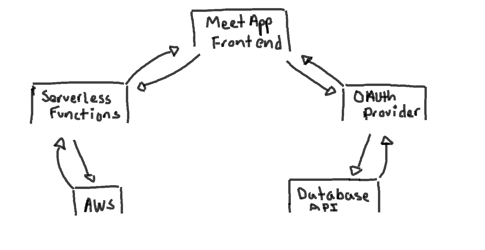

### Outline
- [About the App](https://github.com/vppelli/meet?tab=readme-ov-file#objective-of-meet-app)
- [Live Demo](https://github.com/vppelli/meet?tab=readme-ov-file#live-demo)
- Project Features & Scenarios
  - [Feature 1](#feature-1-filter-events-by-city)
  - [Feature 2](#feature-2-showhide-event-details)
  - [Feature 3](#feature-3-specify-number-of-events)
  - [Feature 4](#feature-4-use-the-app-when-offline)
  - [Feature 5](#feature-5-add-an-app-shortcut-to-the-home-screen)
  - [Feature 6](#feature-6-display-charts-visualizing-event-details)
  - [Serverless function](#how-meet-app-will-use-serverless-function)
  - [Bonus Diagram](#meet-app-diagram-exercise-42)
- [API](#api-used)

## Objective of Meet App
To build a serverless, progressive web application (PWA) with React using a
test-driven development (TDD) technique. The application uses the Google
Calendar API to fetch upcoming events.
  
# [Meet App](https://vppelli.github.io/meet/) Live Demo

## Project Features & Scenarios
> User stories and scenarios 1-6

### Feature 1 Filter Events By City
As a user, I should be able to filter events by city. So that I can see a list of events taking place in that city.
- Scenario 1: When the user hasn’t searched for a specific city, show upcoming events from all cities.
  - Given the main page with the search option has been opened;
  - When the user entered a city;
  - Then they should be shown upcoming events for that city.
- Scenario 2: Users should see a list of suggestions when they search for a city.
  - Given the main page with the search option has been opened;
  - When the user opens the app;
  - Then they should be shown a list of all events for all the cities available.
- Scenario 3: User can select a city from the suggested list.
  - Given user was typing "Berlin" in the city textbox AND the list of suggested cities is showing,
  - When the user selects a city (e.g., "Berlin, Germany") from the list;
  - Then their city should be changed to that city (i.e., "Berlin, Germany") AND the user should receive a list of upcoming events in that city.
    
### Feature 2 Show/Hide Event Details
As a User, I should be able to Show/Hide Event Details. So that I can learn more about the Event.
- Scenario 1: An event element is collapsed by default.
  - Given user has found an event
  - When the user views an event element
  - Then the event details should be collapsed by default
- Scenario 2: User can expand an event to see details.
  - Given the user has found an event
  - When the user clickes an event details
  - Then the event details should be expanded
- Scenario 3: User can collapse an event to hide details.
  - Given the user has expanded the event details, and wants to close it
  - When the user clicks the hide details
  - Then the event details should collapse

### Feature 3 Specify Number of Events
As a User, I should be able to Specify Number of Events. So that viewing events are better.
- Scenario 1: When user hasn’t specified a number, 32 events are shown by default.
  - Given the user wants to see all events without specifing a number
  - When the user views the event shown on search
  - Then the amount of events shown will be 32
- Scenario 2: User can change the number of events displayed.
  - Given the user wants to see all events but 5 at a time
  - When the user specifies 5 in search field
  - Then the events will show only 5 

### Feature 4 Use the App When Offline
As a User, I should be able to Use the App When Offline. So that when theres no connection I can still view my Event history.
- Scenario 1: Show cached data when there’s no internet connection.
  - Given the user has no internet access and is in offline mode
  - When the user opens the events from last time
  - Then it will show the last loaded events
- Scenario 2: Show error when user changes search settings (city, number of events).
  - Given the user changes search settings in offline mode
  - When the user attempts to changes search
  - Then the page will not load and show an error message indicating that changes will not load in offline

### Feature 5 Add an App Shortcut to the Home Screen
As a User, I should be able to Add an App Shortcut to the Home Screen. So that it is of easy access.
- Scenario 1: User can install the meet app as a shortcut on their device home screen
  - Given the user wants to add the app as a shortcut
  - When the user adds it to there device home screen
  - Then they will have easy access from there devices home screen to the events app

### Feature 6 Display Charts Visualizing Event Details
As a User, I should be able to Display Charts Visualizing Event Details. So that I am aware of how many events are avalible and where.
- Scenario 1: Show a chart with the number of upcoming events in each city.
  - Given the user wants to view the ammount of events upcoming based on city
  - When the user selects the option to view a chart of upcoming events
  - Then the events should display a chart of upcoming events in a city and how many

### How Meet App will use serverless function
Serverless function can be used to enhance the functionality of the app. It can provide Real-time updates, Personalized experiences as event recommendations, Event data processing, Notifications, Geolocation and Location-Based services for events, Handle API requests to Googles Cloud, and being able to automatically scale base on demand!

### Meet App Diagram Exercise 4.2

# API Used
Google Cloud API [https://console.cloud.google.com/welcome/new?authuser=1&project=unique-badge-410116&supportedpurview=project](https://console.cloud.google.com/welcome/new?authuser=1&project=unique-badge-410116&supportedpurview=project)
